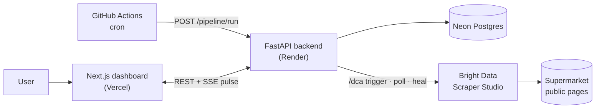
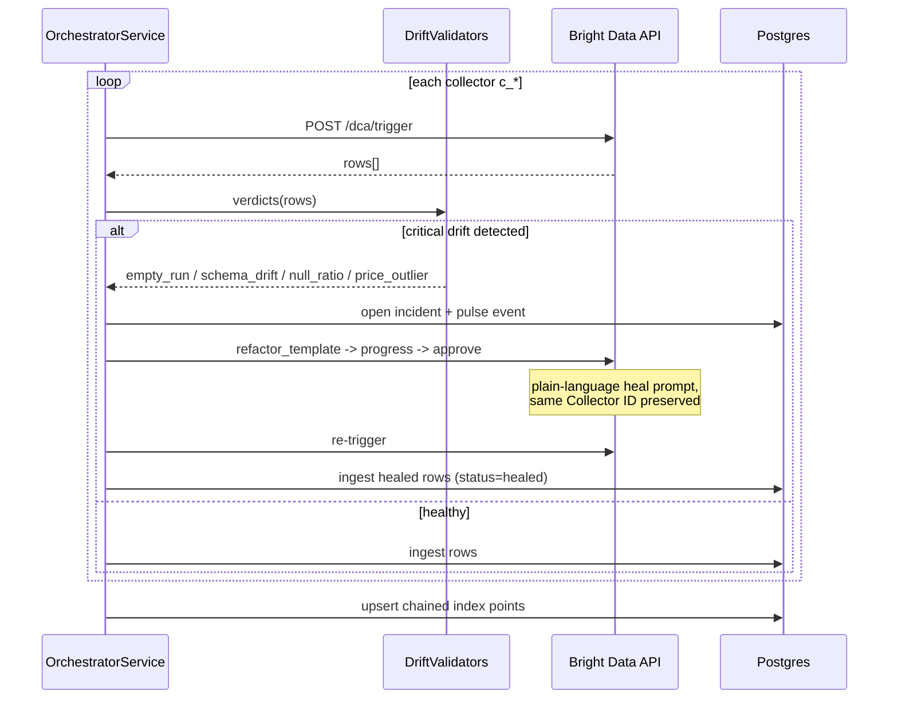

# Mehngai 📈

> A live, independent cost-of-living index — computed daily from real shelf prices by **self-healing web scrapers** that never go down.
>
> *Into the Scrape-Verse* hackathon submission · WeMakeDevs × Bright Data · Aug 2026

Official inflation stats lag weeks and measure baskets nobody buys. Mehngai reads regional supermarket catalog pages daily through Bright Data Scraper Studio collectors, normalizes everything into comparable ₹/kg·₹/L unit prices, chains them into a transparent index — and when a retail site changes its layout at 2am, the built-in watchdog detects the drift and heals the collector autonomously. Same Collector ID, zero downtime, receipts logged.

## Architecture

Editable HLD: [`docs/HLD.md`](docs/HLD.md) · TS reference prototype: [`prototype/`](prototype)



### The self-healing loop (the heart of this project)



## AI component

`GET /api/v1/insights/daily` produces a plain-language daily briefing from verified data facts. Point `AI_BASE_URL` at any OpenAI-compatible endpoint — **Ollama locally** (`http://localhost:11434/v1`), or a DGX Spark later — for LLM narration; without it, a deterministic template briefing is served so the feature never breaks and costs nothing.

## Monorepo layout

```
├── docs/               HLD + diagrams (mermaid, renders on GitHub)
├── backend/            FastAPI · SQLAlchemy · hexagonal ports/adapters · pytest (11 tests)
│   ├── app/{core,domain,ports,adapters,services,api}
│   ├── scripts/seed_mock.py   # 14-day history backfill, zero credits
│   ├── tests/          validators · normalizer · index math · heal-flow orchestration
│   └── render.yaml     # one-click Render deploy
├── frontend/           Next.js editorial dashboard (Vercel) — in progress
└── prototype/          TypeScript reference implementation kept for provenance
```

## Run it locally (mock mode — no Bright Data account needed)

```bash
cd backend
python -m venv .venv && source .venv/bin/activate
pip install -r requirements.txt
cp .env.example .env          # COLLECTOR_IDS=mock-chain-a,mock-chain-b,mock-chain-c
python -m scripts.seed_mock --days 14
uvicorn app.main:app --reload
```

Then:

```bash
curl localhost:8000/api/v1/index                       # chained index series
curl "localhost:8000/api/v1/prices?q=milk"             # cross-chain price grid
curl localhost:8000/api/v1/movers?window_days=7        # wall of movers
curl localhost:8000/api/v1/insights/daily              # AI briefing
curl -X POST -H "Authorization: Bearer devtoken" \
     localhost:8000/api/v1/pipeline/run                # nightly run (mock scraper)

# watch the self-healing loop live:
MOCK_FAIL_COLLECTOR=mock-chain-b uvicorn app.main:app --port 8001
# then run the pipeline again -> drift -> auto-heal -> status=healed
```

## Switching to real Bright Data collectors

```bash
npx -p @brightdata/cli bdata scraper create <catalog-url> "Extract product title, price, pack size"
export BRIGHTDATA_API_KEY=...      # headless auth, no bdata login needed
COLLECTOR_IDS=c_aaa,c_bbb,c_ccc    # pin real IDs; MOCK_MODE off automatically
```

## Compliance

Public catalog pages only · no login/paywall/personal data · no government sites · custom Scraper Studio collectors (not library) · secrets via env only · AI assistance disclosed.
