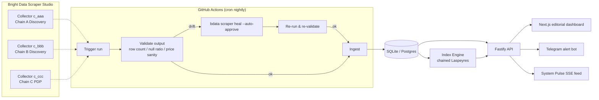
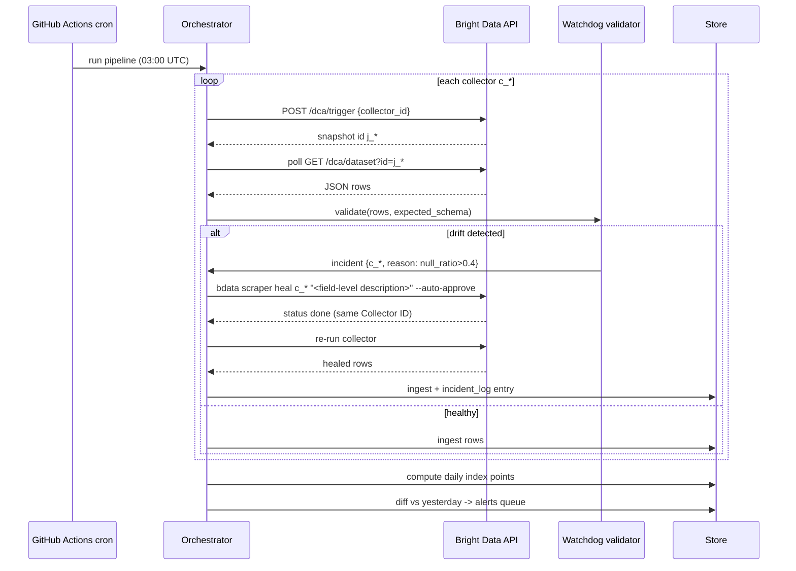
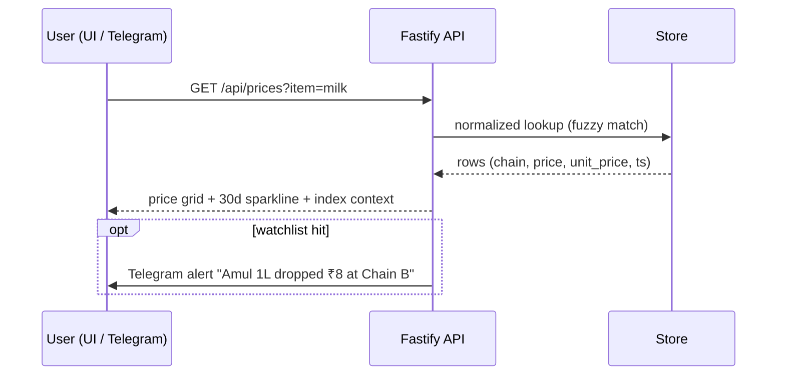

# MEHNGAI — Live Cost-of-Living Index

> **Into the Scrape-Verse** hackathon submission · WeMakeDevs × Bright Data · Aug 2026
>
> Official inflation numbers lag by weeks and measure baskets nobody buys. Mehngai computes a transparent cost-of-living index **daily**, from real shelf prices on real supermarket websites — and stays alive with autonomous self-healing scrapers when those sites change.

---

## 1. The problem (of scale)

- Inflation is the most universally-felt economic force on earth; official CPI releases lag 4–6 weeks and use abstract fixed baskets.
- Regional/niche grocery retailers are invisible to national indices, yet millions buy from them daily.
- Every existing price-tracking tool dies within months because retail frontends churn constantly — **reliable longitudinal price data has never been collectible before self-healing scrapers existed.**

## 2. What we built

| Layer | What it does |
|---|---|
| **Collector fleet** | Custom Bright Data Scraper Studio collectors (Discovery + PDP types) over N regional supermarket chains' public catalog pages |
| **Watchdog** | Nightly GitHub Actions run → schema validation per collector → on drift (empty rows / null ratio / price-sanity violations) auto-fires `bdata scraper heal --auto-approve` → re-verifies → logs incident |
| **Pipeline** | Normalization (units, pack sizes, currency), entity resolution across chains, SQLite/Postgres storage, index computation |
| **Mehngai Index** | Chained Laspeyres-style basket index, base = first collection day; published per chain + blended national view |
| **Product surface** | Editorial dark UI (Next.js): search any item → live cross-chain prices; watchlist → Telegram drop alerts; Wall of Shame (biggest weekly movers); **System Pulse** feed streaming watchdog/heal events into the product |
| **API** | `GET /api/prices?item=&chain=`, `GET /api/index`, `GET /api/pulse` |

## 3. Why this wins — judged-criteria mapping

| Criterion (equal weight) | How Mehngai scores it |
|---|---|
| Potential impact | Inflation touches every human; independent real-time measurement = civic infrastructure |
| Creativity & innovation | Nobody builds macro-index infrastructure at a scraping hackathon; "crowd-built CPI" framing is fresh; System-Pulse makes healing a *product feature*, not plumbing |
| Technical excellence | Drift detection heuristics, unit normalization, chained index math, event-sourced pulse log, CI-native ops |
| Use of Scraper Studio | Central — every data point originates from Studio collectors via CLI/API; Collector IDs pinned in agent rules file |
| Reliability & self-healing | Automated detect→heal→verify loop with incident ledger; demo shows live break + autonomous recovery, zero downstream changes |
| Presentation | Rising-price charts are visceral; "your government says 4%, your basket says 11%" headline |

## 4. Compliance guardrails (hard rules)

1. **No government websites** (Rule 7) — targets are private regional retail chains only.
2. **Library check first**: before creating each collector, confirm target ∉ Bright Data pre-built scrapers library (browse https://brightdata.com/cp/scrapers/browse). Backup chain list ready for swaps.
3. Public pages only — no login, no paywall, no personal data (Rule 6).
4. All collectors created via Scraper Studio CLI (`bdata scraper create`) — custom, not library (Rule 5).
5. Secrets only in `.env` (`BRIGHTDATA_API_KEY`); masked in demo video (Rules/best practices).
6. AI assistance disclosed in README (Rule 11); authors can explain every module (Rules 12–13).
7. Submission artifacts: public repo, README, sample structured output, demo video, Scraper Studio explanation (Rule 10).

## 5. Architecture



### Sequence — nightly collection + drift handling



### Sequence — user-facing query path



## 6. Data model

```sql
runs(id, collector_id, chain, started_at, row_count, status, heal_count)
items(id, canonical_name, category, unit_label, grams_ml)
observations(id, run_id, raw_name, brand, pack_size, price, currency,
             unit_price, url, collected_at)          -- immutable raw
index_points(day, scope, value, method)               -- scope: chain or 'blend'
incidents(id, collector_id, detected_at, reason, heal_prompt, resolved_at, outcome)
pulse_events(id, ts, level, kind, message)            -- feeds System Pulse UI
watchlist(id_hash, item_id, channel, target_price)
```

## 7. Self-healing doctrine (the demo core)

- **Detection heuristics:** zero-row runs, null-ratio > 40% on any field, unit-price outliers > 10× median, schema-key mismatch.
- **Healing:** field-level plain-language prompts (<1000 chars), `--auto-approve` only after the same prompt passed once in supervised mode; same Collector ID throughout so nothing downstream breaks.
- **Honesty note (goes in README/video):** if no real-world redesign occurs during the window, we demonstrate healing by introducing a controlled parser fault in one collector via the IDE (simulating an upstream site change, clearly labeled), which the watchdog then repairs autonomously.
- **Incident ledger** is public in-repo (`/incidents/*.json`) — receipts for judges.

## 8. UI blueprint ("editorial, not admin")

- Dark ink background, magazine typography (serif display + mono data accents), generous whitespace.
- ⌘K command palette: `search <item>`, `watch <item>`, `compare <a> vs <b>`, `explain index`.
- Hero: blended index number with 30-day sparkline + delta chip.
- Item page: cross-chain grid, per-gram/litre normalization toggle, sparklines.
- **System Pulse**: right rail, live SSE stream of watchdog events (`⚠ drift on c_bbb → heal dispatched → ✓ recovered in 7m12s`).
- Wall of Shame: top weekly movers, branded cards.

## 9. Monetization roadmap (for the pitch)

1. Affiliate links on item pages (retail programs pay per order).
2. Premium Telegram alerts (price-drop thresholds, chain coverage).
3. Free-tier API + paid tier for journalists/researchers/fintechs.
4. Sponsored "category spotlight" (clearly labeled).

## 10. Build plan (remaining hours)

| Block | Deliverable |
|---|---|
| Now | Repo scaffold, spec, env contract, agent rules file |
| +account | Library check → create 3–4 collectors (parallel) while building pipeline |
| Pipeline | Trigger/poll client, validators, ingester, index engine, pulse logger |
| UI | Next.js shell, hero index, item grid, pulse rail, ⌘K |
| Bot | Telegram watchlist alerts |
| Demo | Break→heal rehearsal, screen recording, README, sample outputs |
| Submit | File form early; iterate after |

## 11. Env contract

```bash
BRIGHTDATA_API_KEY=***          # from Account Settings; CLI uses it headless
COLLECTOR_CHAIN_A=c_xxx         # pinned here AND in CLAUDE.md rules
COLLECTOR_CHAIN_B=c_xxx
COLLECTOR_CHAIN_C=c_xxx
TELEGRAM_BOT_TOKEN=***
DATABASE_URL=file:./mehngai.db
```

## 12. Repo layout

```
mehngai/
├── SPEC.md                  # this file
├── CLAUDE.md                # agent rules: pinned collector IDs + usage
├── .env.example
├── src/
│   ├── lib/brightdata.ts    # trigger/poll/heal clients (REST + CLI wrappers)
│   ├── lib/validate.ts      # drift heuristics
│   ├── lib/ingest.ts        # normalize + store
│   ├── lib/index-engine.ts  # chained index math
│   ├── lib/pulse.ts         # event bus
│   └── app/                 # Next.js UI + API routes
├── pipelines/
│   └── nightly.yml          # GitHub Actions cron workflow
└── incidents/               # public heal ledger
```
