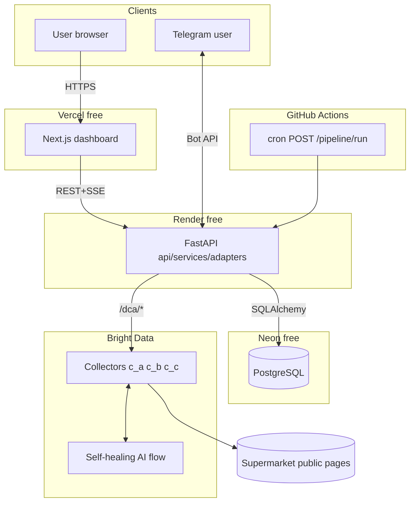
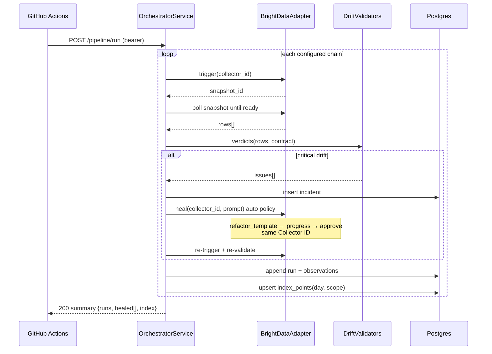
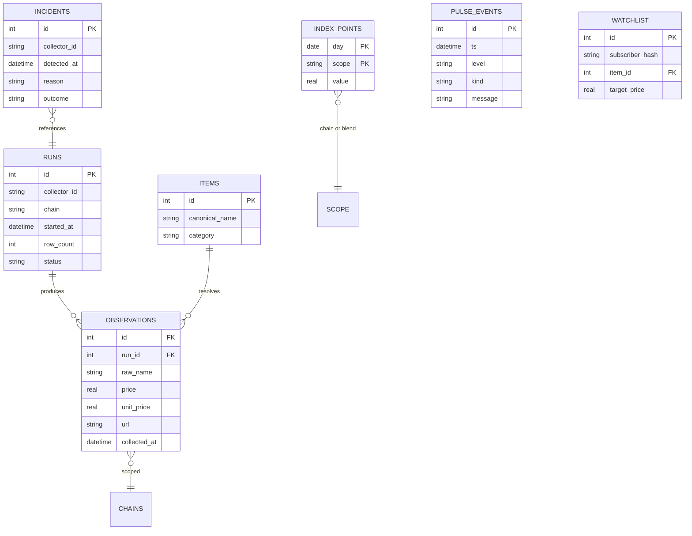

# Mehngai — High-Level Design (HLD)

> Live cost-of-living index powered by Bright Data Scraper Studio self-healing collectors.
> Stack: **FastAPI** (Render) · **Next.js** (Vercel) · **Neon Postgres** · **GitHub Actions** cron · **Telegram**
> Editable diagram source: [`docs/architecture.drawio`](./architecture.drawio)

## 1. System context

Mehngai answers one question daily: *what do everyday goods actually cost, and how fast is that changing?* A fleet of Bright Data Scraper Studio collectors reads regional supermarket catalog pages; output is normalized into comparable unit prices, chained into a basket index, and served through an API and dashboard. A watchdog validates every collection against drift heuristics and triggers Bright Data's self-healing autonomously — same Collector IDs throughout, nothing downstream changes.

### Guiding principles

1. **Hexagonal architecture** — core depends on ports, never vendors. Bright Data is an adapter.
2. **Single writer** — only the Orchestrator writes observations; API routes are read-only.
3. **Append-only raw data** — `observations` are immutable; corrections happen downstream.
4. **Fail loud, heal automatic** — every anomaly becomes a pulse event + incident receipt.
5. **Config over code** — collector IDs/thresholds live in typed env (`pydantic-settings`).

## 2. Components

| Component | Runtime | Responsibility |
|---|---|---|
| Dashboard | Next.js on Vercel | Index hero, item grid, watchlist, Wall of Shame, System Pulse (SSE). Stateless |
| API layer | FastAPI on Render | REST v1 + SSE read models; secured pipeline trigger |
| Orchestrator | FastAPI process | trigger → poll → validate → heal → re-verify → ingest → index. Idempotent per (day, chain) |
| Drift validators | Strategy set | `EmptyRun` `NullRatio` `SchemaDrift` `PriceOutlier` heuristics, pluggable |
| BrightData adapter | Port impl | Async `/dca/trigger`, poll dataset, native heal (`refactor_template`→progress→approve) |
| Index engine | Core service | Unit normalization (₹/kg·L), canonical items, chained Laspeyres |
| Pulse bus | In-process | Pub/sub → SSE clients; durable copy in `pulse_events` |
| Alert channel | Telegram adapter | Watchlist threshold alerts post-ingest |
| Scheduler | GitHub Actions | Nightly `POST /pipeline/run` with bearer token |

## 3. Deployment topology



Render sleeps when idle; the cron hit doubles as wake-up. Neon cold starts (~500ms) absorbed by retry logic.

## 4. Nightly pipeline sequence



## 5. Heal approval policy

First heal of any collector runs supervised (returns diff summary to logs/operator); after one verified success the collector graduates to autonomous `--auto` heals. All outcomes append to `incidents` and emit pulse events. If no real site change occurs during the hackathon window we rehearse healing by introducing a labeled parser fault via the Studio IDE — honestly documented.

## 6. Data model (ER)



Unit price = `price / pack_base` where pack base normalizes kg/g → grams, L/ml → millilitres; ₹/1000g or ₹/1000ml displayed as ₹/kg · ₹/L.

## 7. API contract (v1)

| Method | Path | Auth | Purpose |
|---|---|---|---|
| GET | `/api/v1/health` | – | liveness + db check |
| GET | `/api/v1/index?days=30&scope=` | – | index series + latest value |
| GET | `/api/v1/prices?q=milk` | – | fuzzy item match → cross-chain grid + sparklines |
| GET | `/api/v1/movers?window=7d` | – | Wall of Shame data |
| GET | `/api/v1/pulse/stream` | – | SSE live watchdog feed (+ recent replay) |
| POST | `/api/v1/pipeline/run` | bearer | orchestrates nightly run synchronously (CI caller) |

Errors: RFC-style `{detail, code}` via central exception handlers; 429 on concurrent pipeline runs (idempotency lock per day).

## 8. Security

Secrets only as env vars (Render/Vercel dashboards); `.env.example` documents shape. Pipeline endpoint behind shared bearer token; CORS restricted to the Vercel origin; no personal data collected anywhere; public catalog pages only; government domains excluded by policy.

## 9. Testing strategy

- Unit: validators (table-driven edge cases), normalizer/pack parsing, index math golden files.
- Port mocked with respx/httpx MockTransport: full orchestrator happy-path + drift→heal→recover path without network.
- Contract smoke: recorded sample collector JSON committed under `tests/fixtures/`.

## 10. Repo layout

```
mehngai/
├── docs/ (HLD.md, architecture.drawio)
├── backend/
│   ├── app/{core,domain,ports,adapters,services,api}/
│   ├── tests/
│   ├── Dockerfile · pyproject.toml · render.yaml
├── frontend/          # Next.js → Vercel
├── prototype/         # TS reference implementation kept for provenance
└── SPEC.md
```
